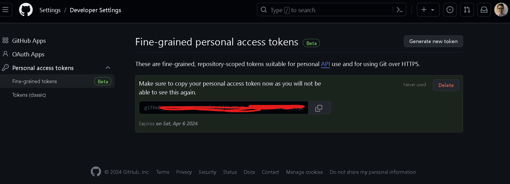

This repo contains 3 different data engineering projects.
---
Folder CI_Error
contains a CI Run Extrator program, that analyzes data from a real NGO project by Ruby4Good. 

To run it successfully, you need to generate a Github token from the settings of your personal account. Below is a picture that demonstrates that process:



Important to create the .env file with variable linking to your token information.
---
Folder Audio Processing
Here we created a Kaggle guided audio data project. 

More info can be seen here: https://www.kaggle.com/datasets/primaryobjects/voicegender/code
The specific code was tested before and details can be found here: https://www.kaggle.com/code/tataiee1375/starter-gender-recognition-by-voice-7236f2c0-c

## Installation

Before running the project, ensure you have Python installed on your system. Then, install the required Python packages using the following commands:

```sh
pip install pandas
pip install numpy
pip install matplotlib
pip install seaborn
pip install scikit-learn
```

If you have errors related to any packages being used by the program, you have to run the commands to install them like explained before.


